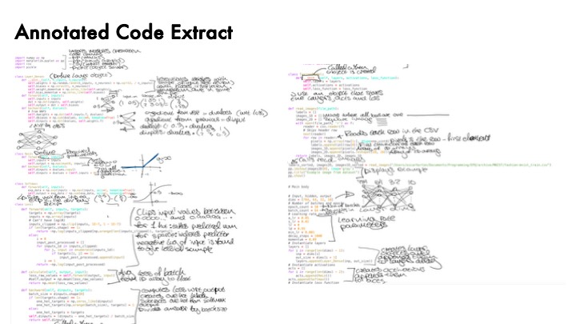
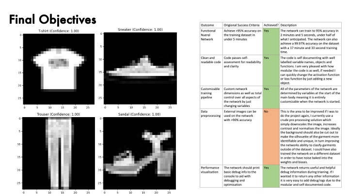

# Project case study

## Objective

I set out to create a deep-learning model from scratch in a high-level language and use it to categorise clothing. My main objective was educational: I wanted to understand the mathematics and mechanics hidden by production frameworks while producing a measurable software artefact.

The original success criteria were:

- exceed 95% accuracy on the training dataset in under five minutes;
- keep the code readable and modular;
- allow the architecture and training settings to be changed centrally;
- classify external clothing images after preprocessing;
- print useful training diagnostics.

## Development

The project progressed through three technical stages.

### 1. Small synthetic network

I first classified points in a small two-dimensional dataset. This made it possible to inspect every layer and debug the forward pass, loss calculation and gradients before working with images.

### 2. Fashion-MNIST pipeline

I replaced the synthetic dataset with 60,000 labelled 28 x 28 grayscale images. The input layer grew to 784 values and the output layer represented ten garment categories. I added CSV loading, normalisation, mini-batches, shuffled epochs and model serialisation.

### 3. Optimisation and external images

I added He-style initialisation, momentum and a scheduled learning rate to improve convergence. I also built a simple preprocessing path for external images using grayscale conversion, contrast enhancement and resizing.

## Implementation choices

### Dense layers

Each layer computes `XW + b`. During backpropagation it calculates gradients for the weights, biases and preceding layer using matrix multiplication.

### ReLU and softmax

ReLU introduces non-linearity in the hidden layers. The output layer uses a numerically stable softmax calculation so its ten outputs sum to one.

### Loss and gradients

Categorical cross-entropy measures the model's error. Combining its derivative with softmax gives the compact gradient `(probabilities - one_hot_targets) / batch_size`.

### Optimisation

The training loop shuffles examples between epochs and processes mini-batches. Momentum retains part of the previous update, while a scheduled learning rate reduces the step size later in training.

## Evaluation and limitations

The report recorded 95% training accuracy after 2 minutes 5 seconds and 99.97% after 17 minutes 33 seconds. A saved 50-epoch notebook run ended at 94.25% training accuracy. Different run lengths and random initialisation account for some variation.

The reported figures do not measure performance on an independent test set. Testing a sample drawn from the training CSV demonstrates inference but not generalisation, and the near-perfect longer result may indicate overfitting. A stronger evaluation would reserve validation and test splits, fix random seeds, report a confusion matrix and compare repeated runs.

External-image preprocessing also remained the weakest objective. Resizing and contrast enhancement worked for selected images with clear backgrounds, but the method did not reliably remove backgrounds, centre garments or handle unfamiliar photography. Confidence values on those examples should not be interpreted as calibrated probabilities.

## Next technical steps

1. Separate training, validation and test data before tuning.
2. Add deterministic experiment configuration and metric logging.
3. Verify analytical gradients with finite differences.
4. Improve preprocessing with segmentation, centring and inversion checks.
5. Compare the NumPy implementation with a small PyTorch baseline.

## Skills demonstrated

This project required independent research, mathematical reasoning, NumPy programming, debugging and performance tuning. It also developed project planning, evidence-based evaluation and the ability to explain technical work through an extended report and presentation.

See [CITATIONS.md](../CITATIONS.md) for the complete bibliography.
